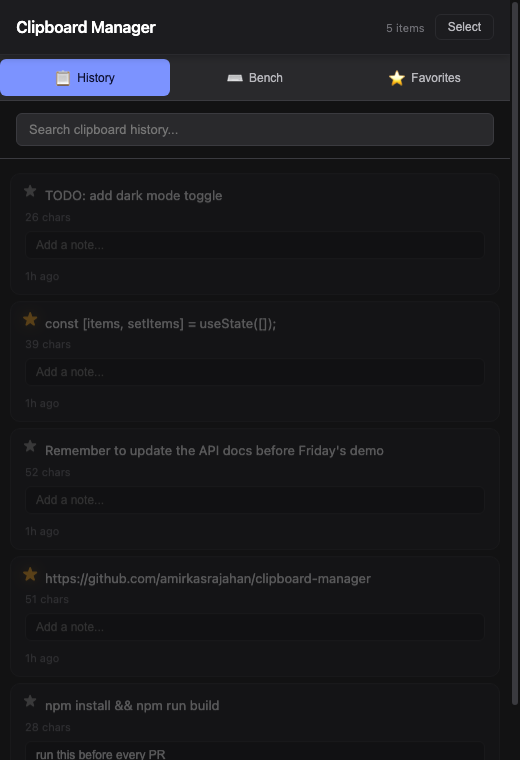

# Clipboard Manager

A desktop clipboard history manager. Runs in the background, watches the system
clipboard, and keeps a searchable history — with notes, favorites, and a
scratchpad for combining multiple copied snippets into one block of text.

Built with Electron + React on the frontend and a small Flask + SQLite backend
for persistence.



## Features

- **Auto-tracking** — polls the system clipboard every second and saves new
  copies automatically. Re-copying something already in your history bumps it
  back to the top instead of creating a duplicate entry.
- **Search** — press `/` to jump to the search box, matches are highlighted
- **Per-item notes** — attach a note to any entry
- **Favorites** — star items to keep them easy to find
- **Selection mode** — multi-select entries (in click order) and use
  **Add to Bench** to concatenate them into one block of text you can copy out
- **Click to copy** — click any entry to put it back on the clipboard

## Tech stack

- **Frontend**: React (Create React App) + Electron
- **Backend**: Flask, Flask-SQLAlchemy, Flask-CORS
- **Storage**: SQLite (`backend/instance/clipboard.db`, created automatically
  on first run)

## Running it locally

### Quick start (after one-time setup below)

Double-click **`run-app.command`** in Finder. It starts the backend, waits for
it, starts the React dev server, waits for that, then launches Electron —
closing the app window shuts both servers down automatically.

### One-time setup

**1. Install frontend dependencies**

```bash
npm install
```

**2. Install backend dependencies**

```bash
cd backend
python3 -m venv venv
source venv/bin/activate
pip install -r requirements.txt
```

### Running manually (what `run-app.command` does, step by step)

**1. Start the backend** (from `backend/`, with `venv` active — runs on
`localhost:5001`)

```bash
python main.py
```

**2. Start the React dev server** (from the repo root — runs on
`localhost:3000`)

```bash
npm start
```

**3. Start Electron** (from the repo root, once the above two are running)

```bash
npm run electron-dev
```

This launches the Electron window (500x700) pointed at the React dev server.
The backend must be running first — if it isn't, the app still opens but
clipboard history won't persist, and you'll see an error toast at the bottom.

Debug mode (Flask's interactive debugger) is off by default; set
`FLASK_DEBUG=1` before running `python main.py` to enable it.

## Testing

The backend has a `pytest` suite covering all 4 routes, including the
duplicate/bump logic and validation.

```bash
cd backend
source venv/bin/activate
pip install -r requirements-dev.txt   # first time only
pytest -v
```

## Project structure

```
backend/main.py               Flask API — /history (GET/POST), /history/:id (PATCH/DELETE)
backend/test_main.py          pytest suite for the backend
backend/requirements.txt      runtime dependencies
backend/requirements-dev.txt  test-only dependencies (pytest)
public/electron.js            Electron main process — clipboard polling, window setup
public/preload.js             IPC bridge exposed to React as window.electronAPI
src/App.jsx                   App state + logic — history, search, selection mode
src/Views/                    History, Favorites, and Concat Bench screens
src/components/               Clipboard item card
run-app.command                One-click launcher (backend + frontend + Electron)
```

## Known limitations

- History is capped at the 50 most recent items — older entries stay in the
  database but aren't shown
- Single device only — nothing syncs across machines
- `db.create_all()` only creates tables that don't exist yet; if the model
  changes later, delete `backend/instance/clipboard.db` to rebuild it
